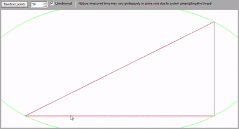

# Delaunay Triangulation

Performs constrained or unconstrained triangulations

Implements the algorithm described by Sloan <https://doi.org/10.1016/0141-1195(87)90043-X>

## Dependencies

* GLM
* wxWidgets (only for test/demo)

## Demo
